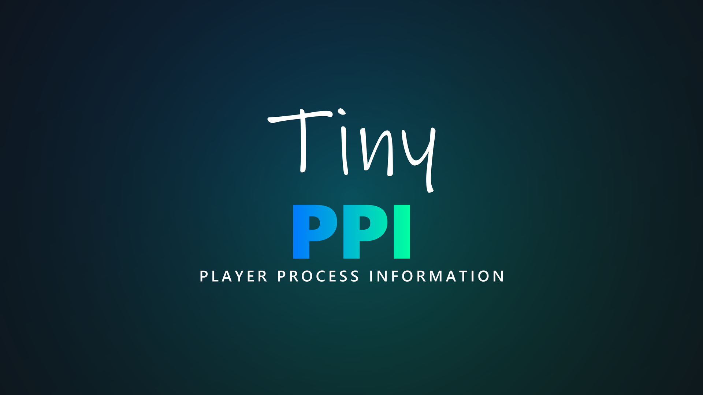

<p align="center">
  
</p>

A CoreELEC addon that displays detailed playback information in a custom overlay window during video playback. It provides real-time data on video, audio, HDR, system resources, and more — with special support for **Amlogic** hardware (e.g. CoreELEC devices).

---

## Screenshots
<p align="center">

</p>

<p align="center">

</p>

<p align="center">

</p>

---

## Installation

### Via Repository

1. Open **Settings → File Manager → Add Source**.
2. Enter the repository URL and confirm:
   ```
   https://ce-repo.github.io/repository.jamal2362/
   ```
3. Go to **Add-ons → Install from ZIP file** and select the source you just added.
4. Install the repository ZIP file.
5. Go to **Install from repository**, open the repository, select **TinyPPI** and install.

---

## Usage

### Assign a remote shortcut — Easy way (Keymap Editor)

1. Install the **Keymap Editor** addon.
2. Open it and select **Edit → Global → Add-ons**.
3. Select **Launch TinyPPI**.
4. Press the key or button you want to assign, then confirm.
5. Go back and select **Save**.

Pressing the assigned key/button will now launch or close TinyPPI in the Video OSD.

### Assign a remote shortcut — Manual (`gen.xml`)

Place the following in `Userdata/keymaps/gen.xml`, replacing `xxxxx` with your key name:

```xml
<keymap>
  <global>
    <keyboard>
      <xxxxx>RunAddon(script.tinyppi)</xxxxx>
    </keyboard>
  </global>
</keymap>
```

### Launch from another addon or autostart (Python)

```python
import xbmc
xbmc.executebuiltin('RunScript(script.tinyppi)')
```

### Launch via Kodi URL

```
plugin://script.tinyppi/
```

### The fastest shortcut there is

Every launch above starts a Python script, and Kodi builds a fresh interpreter
for one each time. TinyPPI's background service is already running with
everything loaded, so it opens the overlay itself and the launch is only there
to ask it to — which it does within a few milliseconds.

A keymap can ask it directly instead, skipping the script entirely:

```xml
<keymap>
  <global>
    <keyboard>
      <xxxxx>NotifyAll(script.tinyppi,open_overlay)</xxxxx>
    </keyboard>
  </global>
</keymap>
```

Use `open_dialog` in place of `open_overlay` for the VS10 mode dialog. The key
toggles the same way `RunAddon` does — pressed again while TinyPPI is up, it
closes it. This needs TinyPPI's service to be running, which it is unless the
addon has been disabled; `RunAddon(script.tinyppi)` keeps working either way and
falls back to opening the overlay in its own script if the service does not
answer.

---

## Colors

Every color in the settings is chosen in Kodi's own color picker: select the
setting and pick a tile. The picker offers TinyPPI's own palette of 250 colors
(250 dark shades for backgrounds), and the setting's row shows the color in
force. The tiles are sorted by color: grays first (neutral, cool, warm), then
red, orange, yellow, green, cyan, blue, violet and pink, each in a vivid and a
soft family (Red, Soft red; for backgrounds Dark red, Dusky red), each family
light to dark. Every tile is named after its family and numbered within it:
Red, Red 1, Red 2 and so on. The colors the settings start out on (White,
Charcoal, Forest, ...) keep their translated names.

The first tile in the picker is **HEX color**. It opens the keyboard on the
current color's 6-digit HEX code, to be changed to any color at all. The second
tile is the setting's default color, marked (Default), so it is always one step
away; the rest of the palette follows. The opacity of each element stays a
slider of its own beside its color.

---

## Codec Logos

TinyPPI can display the current **video (HDR) and audio format** as stacked logos
directly on the video window during playback. By default the video/HDR logo sits on
top and the audio logo below it, on a rounded panel whose colors and opacity are
fully themeable in the add-on settings. The logos are re-resolved live, so switching
the audio track updates the audio logo on the fly.

You can enable the logos in three independent situations (**Settings → Codec logos**):

- **On playback start** — shown for the first few seconds after a video starts
  (duration configurable).
- **While the Video OSD is open** — shown whenever the player OSD is visible.
- **While the TinyPPI overlay is open** — shown alongside the info overlay.

For each situation the horizontal/vertical position and the size can be adjusted
separately, and so can the logo stack itself:

- **Logo order** — *Video on top, audio below* (default) or *Audio on top, video
  below*.
- **Show video codec logo** / **Show audio codec logo** — turn either one off to
  leave just the other logo on the panel. With both on, the panel keeps its
  all-or-nothing behavior and stays hidden for an audio codec that has no logo.
  A video with no audio track at all shows its video logo on its own.
- **Dolby Vision pill position** — the layer pill (FEL / MEL / other DV profile)
  sits on the panel's *Bottom edge* (default) or its *Top edge*.

### Supported formats

**Video / HDR**

| Logo | Format |
|------|--------|
| SDR | Standard Dynamic Range |
| HDR10 | HDR10 |
| HDR10+ | HDR10+ |
| HLG | Hybrid Log-Gamma |
| Dolby Vision | Dolby Vision |

**Audio**

| Logo | Format |
|------|--------|
| AAC | AAC |
| AAC-LC | AAC Low Complexity |
| AAC LATM | AAC in LATM/LOAS |
| AAC-LTP | AAC Long Term Prediction |
| AAC-SSR | AAC Scalable Sample Rate |
| HE-AAC | High-Efficiency AAC |
| HE-AAC v2 | High-Efficiency AAC v2 |
| Dolby Digital | Dolby Digital (AC-3) |
| Dolby Digital Plus | Dolby Digital Plus (E-AC-3) |
| Dolby Digital Plus Atmos | Dolby Digital Plus with Dolby Atmos |
| Dolby TrueHD | Dolby TrueHD |
| Dolby TrueHD Atmos | Dolby TrueHD with Dolby Atmos |
| DTS | DTS |
| DTS 96/24 | DTS 96/24 |
| DTS-ES | DTS-ES |
| DTS-Express | DTS Express |
| DTS-HD HRA | DTS-HD High Resolution Audio |
| DTS-HD MA | DTS-HD Master Audio |
| DTS:X | DTS:X |
| IMAX | DTS:X IMAX Enhanced |
| FLAC | FLAC |
| PCM | PCM / LPCM |
| MP3 | MP3 |
| OGG | Ogg Vorbis |
| OPUS | Opus |
| VORBIS | Vorbis |

Formats without a matching logo simply omit the audio image.

---

## Channel Layout Graphic

TinyPPI can display a **speaker layout graphic** for the current audio track,
visualising how many channels the stream carries and where the active speakers
sit. The active speakers are highlighted against the full layout, so a 5.1 track
lights up its six positions while the remaining speaker slots stay dimmed.

The graphic can be enabled independently per output type
(**Settings → Channels**):

- **Channels in SDR** — show the layout while playing SDR content.
- **Channels in HDR10 / HLG / HDR10+** — show the layout while playing HDR content.
- **Channels in Dolby Vision** — show the layout while playing Dolby Vision content
  (drawn in its own panel above the main info box).

The colors of the background box, the speaker layout behind the active channels,
and the active channels themselves are all fully themeable in the add-on settings.

### Supported layouts

| Graphic | Layout |
|---------|--------|
| 1.0 | Mono |
| 2.0 | Stereo |
| 2.1 | Stereo + LFE |
| 3.1 | 3.1 surround |
| 4.1 | 4.1 surround |
| 5.1 | 5.1 surround |
| 5.1.2 | 5.1.2 with height channels (Atmos / DTS:X) |
| 6.1 | 6.1 surround |
| 7.1 | 7.1 surround |
| 7.1.2 | 7.1.2 with height channels (Atmos / DTS:X) |

The height variants (5.1.2 / 7.1.2) are selected automatically for Dolby Atmos
and DTS:X streams — Kodi reports only a channel count, so the extra height
channels are inferred from the codec. Channel counts without a matching graphic
simply omit the image.

---

## Dolby Vision Metadata View

The view is switched by **Settings → DV metadata → Dolby Vision metadata
view**, which is on out of the box; with it off, **OK** on the overlay does
nothing.

With it on, pressing **OK** on the open TinyPPI overlay during a **Dolby
Vision** source switches to a debug view listing everything the stream's side
data carries — far more than the overlay itself has room for. The list
refreshes ten times a second, so the per-frame blocks follow the picture.

| Key | In the list | In a section opened on its own |
|-----|-------------|--------------------------------|
| **Up / Down** | Jump to the previous / next section | Scroll through the section |
| **OK** | Open the section under the cursor on its own | — |
| **Back** | Return to the TinyPPI overlay | Return to the list, on the same section |
| **Stop** | Close TinyPPI | Close TinyPPI |

**Back** on the overlay itself closes TinyPPI, as it always does.

A reading that just moved is written in the highlight colour and stays in it for
**Settings → DV metadata → Changed values → Highlight duration** (750 ms out of
the box), so a change is readable without slowing the refresh down; the
overlay's own Dolby Vision readings have the same pair of settings under
**Settings → TinyPPI overlay → Changed values**. On any other source **OK**
keeps doing nothing: there is no Dolby Vision side data to show.

The view is grouped by metadata block:

| Section | Contents |
|---------|----------|
| Stream | Kodi's own HDR type and detail, the side-data sections that arrived, the stream flags (`converted`, `rpu-removed`, …), the layer structure and the parser version |
| Configuration record | The dvcC / dvvC record: version, profile, compatibility ID, level, RPU / BL / EL presence, metadata compression |
| RPU | Guessed profile, CM version, DM compression, the DM metadata IDs, scene refresh flag and extension-block count, and the full RPU header (types, VDR profile / level / normalized IDC, the VDR sequence-info and DM-metadata presence flags, BL / EL / VDR bit depth, EL type, full range, resampling, residual and coefficient fields, previous-RPU reuse, the NAL prefix and the reserved field) |
| Composer | The reshaping metadata the decoder actually applies to the base layer: the mapping's colour space, chroma format and tile partitioning, then a section per component (Y, Cb, Cr) with its curve shape, its pivots and the coefficients of every segment — and, on the dual-layer profiles that carry one, the NLQ dequantization data |
| L1 | Frame luminance, min / max / average, as raw PQ codes and nits |
| Source master | The PQ range of the master the grade was made from, and its display diagonal |
| Colorimetry | The VDR DM signal description and the YCC → RGB / RGB → LMS matrices, in raw codes |
| L2 / L8 | Every trim pass, as raw 12-bit codes and on the Dolby UI scale, plus L8's secondary saturation / hue vectors on the streams that carry them and each pass's own block length |
| L3 | PQ offsets |
| L4 | Temporal stability: the anchor PQ and power |
| L5 | Active-area offsets (the black bars the RPU declares) |
| L6 | The RPU's own mastering display and MaxCLL / MaxFALL |
| L9 / L10 | Source primaries and the target displays the L8 trims are graded against, each with its block length |
| L11 | Content type, whitepoint, reference mode and the reserved bytes |
| L254 / L255 | The CM v4.0 marker block, and the debug run mode block on the rare stream that carries one |
| Static metadata | The MDCV / CLL SEIs — the stream's own HDR10 layer, shown apart from L6 |
| HDR10+ | The ST 2094-40 payload, when the stream carries one alongside Dolby Vision |

Blocks the stream does not carry are still listed, with their values shown as
`—`, so an absent block is visible rather than silently missing. Reading and
parsing is done by
[script.module.sidedata](https://github.com/matthane/script.module.sidedata);
the field names and units follow its own field reference.

Everything in the view is printed as the bitstream carries it, with one
exception: the composer's coefficients. The RPU splits each of them into an
integer and a fractional half that say nothing read apart, so they are shown
combined — `int + frac / 2 ** coefficient_log2_denom`, the arithmetic the RPU
syntax itself defines, with the denominator readable in the **RPU** section
above. The composer is also the one part of a parse TinyPPI asks for rather
than always builds: it runs to hundreds of coefficients, so it is read only
while this view is open and the overlay's own polling never pays for it.

---

## VS10 Dialog Layouts

The VS10 dialog — the menu that offers the player-process overlay and whatever
VS10 output modes the playing source has — is drawn in one of three designs.
Pick one under **Settings → VS10 dialog → Layout**:

| Layout | What it looks like |
| --- | --- |
| **Single button** | One button, and **left** or **right** steps it to the next choice. For a remote that has little more than a direction pad and OK. The default. |
| **Bar** | The choices side by side rather than stacked, in a panel low enough to leave most of the picture showing. |
| **Dialog** | The panel the add-on opened with before the layouts existed: the choices stacked. |

Every layout draws the same choices, and how many there are depends on the
source: four on SDR and HDR10, three on Dolby Vision, and the
player-process button on its own where there are no VS10 modes to offer —
HDR10+, HLG, and a Dolby Vision grade carrying HDR10+ alongside its RPU.
A layout keeps the same panel whichever of those is playing and spreads the
choices over it, so the dialog does not change size under you when the
detection finishes.

### Position

Under **Settings → VS10 dialog → Dialog position** the panel can be moved.
All three layouts are narrower than the screen, so both directions apply to
each of them:

- **Vertical position** — 0% is a margin below the top edge of the screen,
  100% rests the panel on the bottom one. Defaults to 100%.
- **Horizontal position** — 0% is the left margin and 100% the right one.
  Defaults to 50%.

The colours of every layout come from the **VS10 dialog** colour settings,
which now include **Button text** — the colour of the buttons the remote is
not sitting on, which the dialog used to take from the overlay's description
colour and so could not be set on its own.

## Web Dashboard

TinyPPI can serve everything the overlay shows to a browser on your phone or
laptop, so the readings can be followed **while the picture stays untouched**:
every reading of the overlay, the Dolby Vision metadata and luminance chart,
the history of the title, a remote and VS10 switching, and the film and series
library with continue watching. The dashboard is off out of the box; switch it
on under **Settings → Dashboard**, then open the address it names on any device
on the same network:

```
http://<box-ip>:8099/
```

**Settings → Dashboard → Show address and token** prints that address together
with the access token, which is what you need standing in front of the TV with
a phone in your hand. It is meant for a home network: **do not forward its port
to the internet**.

Everything about it — the tabs, the themes, the library, the remote, what it
costs the box and how it is secured — is described in
**[docs/web-dashboard.md](docs/web-dashboard.md)**.

---

## Advanced Launch Arguments

TinyPPI supports additional arguments to open specific modes or apply VS10 output modes directly — without opening the overlay or the dialog first.

### Open the VS10 mode selection dialog

```
RunScript(script.tinyppi,dialog)
```

Opens the VS10 mode selection dialog instead of the main TinyPPI overlay.
It shows the modes that apply to the playing source; on an **HDR10+** or
an **HLG** stream — neither of which is a VS10 input — it draws no modes at
all and leaves the player-process button on its own. A **Dolby Vision title
that carries HDR10+ alongside its RPU** is drawn the same way: the driver does
not take a VS10 mode for that hybrid grade, so none is offered. `run_mode`
still applies one there, and says so in the log.

### Apply a VS10 output mode directly

Use `run_mode` followed by the mode name to switch the VS10 output mode immediately. This is useful for keymap shortcuts or automation from other addons.

```
RunScript(script.tinyppi,run_mode,sdr8)
RunScript(script.tinyppi,run_mode,sdr10)
RunScript(script.tinyppi,run_mode,hdr10)
RunScript(script.tinyppi,run_mode,dv)
RunScript(script.tinyppi,run_mode,original_sdr)
RunScript(script.tinyppi,run_mode,original_hdr)
RunScript(script.tinyppi,run_mode,original_dv)
```

| Mode | Description |
|------|-------------|
| `original_sdr` | Pass through SDR content unchanged |
| `original_hdr` | Pass through HDR10 content unchanged |
| `original_dv` | Pass through Dolby Vision content unchanged |
| `hdr10` | Convert to HDR10 output |
| `dv` | Convert to Dolby Vision output |
| `sdr8` | Convert to SDR 8-bit output |
| `sdr10` | Convert to SDR 10-bit output |

#### Example: keymap shortcut for a direct mode switch

```xml
<keymap>
  <global>
    <keyboard>
      <xxxxx>RunScript(script.tinyppi,run_mode,hdr10)</xxxxx>
    </keyboard>
  </global>
</keymap>
```

#### Example: trigger from another addon (Python)

```python
import xbmc
xbmc.executebuiltin('RunScript(script.tinyppi,run_mode,dv)')
```

---

## Tests

Unit tests run outside Kodi (`python3 -m pytest tests`); an end-to-end suite
drives a real Kodi 22 and checks the service, the overlay, the dialogs, the
dashboard and every setting. Both are described in
**[tests/README.md](tests/README.md)**.

---

## Credits

TinyPPI builds on the work of the following projects — many thanks to their authors and contributors.

### script.module.sidedata

[**script.module.sidedata**](https://github.com/matthane/script.module.sidedata) by [matthane](https://github.com/matthane)

Parsers for the raw Dolby Vision and HDR payloads CoreELEC 22 publishes through
`Player.Process(video.sidedata)` — the Dolby Vision RPU and dvcC/dvvC
configuration record, the HDR10+ ST 2094-40 metadata and the static MDCV / CLL
SEIs. TinyPPI reads every DV/HDR value it shows through this module, so the
overlay follows the stream frame by frame instead of probing the file. RPU
parsing is done by quietvoid's [dovi_tool](https://github.com/quietvoid/dovi_tool)
(libdovi), HDR10+ parsing by FFmpeg's libavutil.


---

## License

TinyPPI's **source code** is licensed under the
[**GNU Affero General Public License v3.0 or later**](LICENSE).

The AGPL was chosen over the plain GPL because TinyPPI serves a web dashboard
over the network. Section 13 means that anyone who modifies TinyPPI and lets
others reach it over a network has to offer those users the source of the
modified version — the same obligation a modified copy handed out as a file
already carries.

The **name, the logo and the artwork** are not covered by that license; they
are [all rights reserved, with a limited redistribution license](LICENSE-ASSETS)
for unmodified releases. Forking the code is expressly welcome — a fork just
needs its own name and its own artwork, the way a Firefox rebuild needs to be
called something else. The format logos (Dolby, DTS, IMAX) belong to their
respective owners and are used only to identify the format a stream carries.

Third-party attributions are collected in [NOTICE](NOTICE).

Versions up to and including **2.7.6** were released under the MIT license and
remain available under it.
